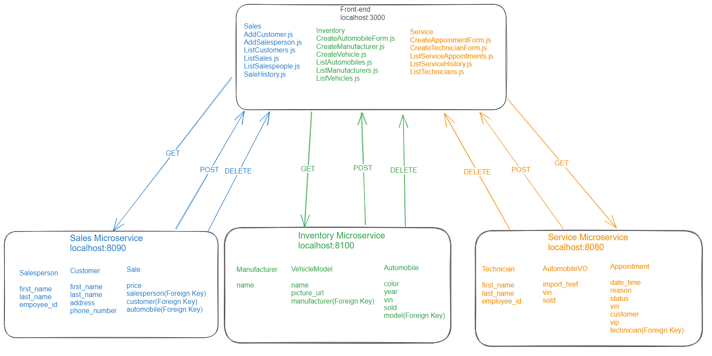

# CarCar

CarCar is a car dealership application to manage your inventory, service, and sales needs. You can manage your inventory by adding manufacturers and the make and model of your cars. Track your sales through the automobiles list in inventory. The Service feature allows you to add technicians and schedule service appointments. It also keeps a service history that you can search by VIN. If it is a returning customer that has previously purchased a vehicle from inventory, they will be flagged as VIP. The Sales feature allows you to add and list customers and salespeople, and record new sales.

Team:

- Ken Yeh - Service Microservice
- Toran O'Brien - Sales Microservice

## Getting started

1. Fork this repository
2. Clone the forked repository to your local computer using: `git clone https://gitlab.com/toranaobrien/project-beta`
3. From your project directory, run the following Docker commands:

```
    docker volume create beta-data
    docker compose build
    docker compose up
```

## Design

#### Inventory endpoints

| Action                         | Method | URL                                          |
| ------------------------------ | ------ | -------------------------------------------- |
| List manufacturers             | GET    | http://localhost:8100/api/manufacturers/     |
| Create a manufacturer          | POST   | http://localhost:8100/api/manufacturers/     |
| Get a specific manufacturer    | GET    | http://localhost:8100/api/manufacturers/:id/ |
| Update a specific manufacturer | PUT    | http://localhost:8100/api/manufacturers/:id/ |
| Delete a specific manufacturer | DELETE | http://localhost:8100/api/manufacturers/:id/ |

Creating and updating a manufacturer requires only the manufacturer's name.

```
{
  "name": "Mazda"
}
```

The return value of creating, getting, and updating a single manufacturer is its name, href, and id.

```
{
  "href": "/api/manufacturers/1/",
  "id": 1,
  "name": "Mazda"
}
```

The list of manufacturers is a dictionary with the key "manufacturers" set to a list of manufacturers.

```
{
  "manufacturers": [
    {
      "href": "/api/manufacturers/1/",
      "id": 1,
      "name": "Mazda"
    }
  ]
}
```

#### Vehicle endpoints

| Action                          | Method | URL                                   |
| ------------------------------- | ------ | ------------------------------------- |
| List vehicle models             | GET    | http://localhost:8100/api/models/     |
| Create a vehicle model          | POST   | http://localhost:8100/api/models/     |
| Get a specific vehicle model    | GET    | http://localhost:8100/api/models/:id/ |
| Update a specific vehicle model | PUT    | http://localhost:8100/api/models/:id/ |
| Delete a specific vehicle model | DELETE | http://localhost:8100/api/models/:id/ |

Creating a vehicle model requires the model name, a URL of an image, and the id of the manufacturer.

```
{
  "name": "Mazda 3 Hatchback Turbo",
  "picture_url": "http://yourPictureUrl.jpg",
  "manufacturer_id": 1
}
```

Updating a vehicle model can take the name and/or the picture URL. <mark>It is not possible to update a vehicle model's manufacturer.</mark>

```
{
  "name": "Mazda 3 Hatchback Turbo",
  "picture_url": "http://yourPictureUrl.jpg"
}
```

Getting the detail of a vehicle model, or the return value from creating or updating a vehicle model, returns the model's information **and** the manufacturer's information.

```
{
  "href": "/api/models/1/",
  "id": 1,
  "name": "Mazda 3 Hatchback Turbo",
  "picture_url": "http://yourPictureUrl.jpg",
  "manufacturer": {
    "href": "/api/manufacturers/1/",
    "id": 1,
    "name": "Mazda"
  }
}
```

Getting a list of vehicle models returns a list of the detail information with the key "models".

```
{
  "models": [
    {
      "href": "/api/models/1/",
      "id": 1,
      "name": "Mazda 3 Hatchback Turbo",
      "picture_url": "http://yourPictureUrl.jpg",
      "manufacturer": {
        "href": "/api/manufacturers/1/",
        "id": 1,
        "name": "Mazda"
      }
    }
  ]
}
```

#### Automobile endpoints

| Action                       | Method | URL                                         |
| ---------------------------- | ------ | ------------------------------------------- |
| List automobiles             | GET    | http://localhost:8100/api/automobiles/      |
| Create an automobile         | POST   | http://localhost:8100/api/automobiles/      |
| Get a specific automobile    | GET    | http://localhost:8100/api/automobiles/:vin/ |
| Update a specific automobile | PUT    | http://localhost:8100/api/automobiles/:vin/ |
| Delete a specific automobile | DELETE | http://localhost:8100/api/automobiles/:vin/ |

You can create an automobile with its color, year, VIN, and the id of the vehicle model.

```
{
  "color": "white",
  "year": 2023,
  "vin": "1MEFM53S4XA661641",
  "model_id": 1
}
```

You query an automobile by its VIN. For example, you would use the URL

http://localhost:8100/api/automobiles/1MEFM53S4XA661641/

to get the details for the car with the VIN "1MEFM53S4XA661641". The details for an automobile include its model and manufacturer.

```
{
  "href": "/api/automobiles/1MEFM53S4XA661641/",
  "id": 1,
  "color": "yellow",
  "year": 2023,
  "vin": "1MEFM53S4XA661641",
  "model": {
    "href": "/api/models/1/",
    "id": 1,
    "name": "Mazda 3 Hatchback Turbo",
    "picture_url": "http://yourPictureUrl.jpg",
    "manufacturer": {
      "href": "/api/manufacturers/1/",
      "id": 1,
      "name": "Mazda"
    }
  },
  "sold": false
}
```

You can update the color, year, and sold status of an automobile.

```
{
  "color": "white",
  "year": 2023,
  "sold": true
}
```

Getting a list of automobiles returns a dictionary with the key "autos" set to a list of automobile information.

```
{
  "autos": [
    {
      "href": "/api/automobiles/1MEFM53S4XA661641/",
      "id": 1,
      "color": "white",
      "year": 2023,
      "vin": "1MEFM53S4XA661641",
      "model": {
        "href": "/api/models/1/",
        "id": 1,
        "name": "Mazda 3 Hatchback Turbo",
        "picture_url": "http://yourPictureUrl.jpg",
        "manufacturer": {
          "href": "/api/manufacturers/1/",
          "id": 1,
          "name": "Mazda"
        }
      },
      "sold": false
    }
  ]
}
```

#### Service endpoints

| Action                               | Method | URL                                                |
| ------------------------------------ | ------ | -------------------------------------------------- |
| List technicians                     | GET    | http://localhost:8080/api/technicians/             |
| Create a technician                  | POST   | http://localhost:8080/api/technicians/             |
| Delete a specific technician         | DELETE | http://localhost:8080/api/technicians/:id/         |
| List appointments                    | GET    | http://localhost:8080/api/appointments/            |
| Create an appointment                | POST   | http://localhost:8080/api/appointments/            |
| Delete an appointment                | DELETE | http://localhost:8080/api/appointments/:id/        |
| Set appointment status to "canceled" | PUT    | http://localhost:8080/api/appointments/:id/cancel/ |
| Set appointment status to "finished" | PUT    | http://localhost:8080/api/appointments/:id/finish/ |

The list technicians endpoint will give you a list of all technicians currently employed. Since this is a GET request no information is needed. Example of returned data:

```
{
	"technicians": [
		{
			"first_name": "Mike",
			"last_name": "Smith",
			"employee_id": "msmith",
			"id": 1
		},
		{
			"first_name": "Ken",
			"last_name": "Yeh",
			"employee_id": "kyeh",
			"id": 2
		},
		{
			"first_name": "Jane",
			"last_name": "Doe",
			"employee_id": "jdoe",
			"id": 3
		},
		{
			"first_name": "TEST",
			"last_name": "TEST",
			"employee_id": "test",
			"id": 4
		}
	]
}
```

To create a technician, the POST request will look like example:

```
{
	"first_name": "Ken",
	"last_name": "Yeh",
	"employee_id": "kyeh"
}
```

To delete a specific technician, simply make a DELETE request to http://localhost:8080/api/technicians/id/ where "id" is the identifier of the technician.

The list appointments endpoint will give you all the appointments currently scheduled. Since this is a GET request no information is needed. Example of returned data:

```
{
	"appointments": [
		{
			"id": 3,
			"date_time": "2023-09-07T17:53:48+00:00",
			"reason": "brake service",
			"status": "finished",
			"vin": "1J4FJ78L5KL535075",
			"customer": "Midas",
			"vip": false,
			"technician": {
				"first_name": "Ken",
				"last_name": "Yeh",
				"employee_id": "kyeh",
				"id": 2
			}
		}
	]
}
```

To delete an appointment simply make a DELETE request to http://localhost:8080/api/appointments/id/ where "id" is the identifier of the appointment.

To set an appointment to "canceled" status, make a PUT request to http://localhost:8080/api/appointments/id/cancel/ where "id" is the identifier of the appointment. Example of returned data:

```
{
	"date_time": "2023-09-07T18:43:32+00:00",
	"reason": "test",
	"status": "canceled",
	"vin": "JH4DA9470NS002903",
	"customer": "TEST",
	"technician": {
		"first_name": "Ken",
		"last_name": "Yeh",
		"employee_id": "kyeh",
		"id": 2
	}
}
```

To set an apppointment to "finished" status, make a PUT request to http://localhost:8080/api/appointments/id/finish/ where "id" is the identifier of the appointment. Example of returned data:

```
{
	"date_time": "2023-09-07T17:53:48+00:00",
	"reason": "brake service",
	"status": "finished",
	"vin": "1J4FJ78L5KL535075",
	"customer": "Midas",
	"technician": {
		"first_name": "Ken",
		"last_name": "Yeh",
		"employee_id": "kyeh",
		"id": 2
	}
}
```

#### Sales endpoints

| Action                        | Method | URL                                        |
| ----------------------------- | ------ | ------------------------------------------ |
| List salespeople              | GET    | http://localhost:8090/api/salespeople/     |
| Create a salesperson          | POST   | http://localhost:8090/api/salespeople/     |
| Delete a specific salesperson | DELETE | http://localhost:8090/api/salespeople/:id/ |
| List customers                | GET    | http://localhost:8090/api/customers/       |
| Create a customer             | POST   | http://localhost:8090/api/customers/       |
| Delete a specific customer    | DELETE | http://localhost:8090/api/customers/:id/   |
| List sales                    | GET    | http://localhost:8090/api/sales/           |
| Create a sale                 | POST   | http://localhost:8090/api/sales/           |
| Delete a sale                 | DELETE | http://localhost:8090/api/sales/:id/       |

The list salespeople endpoint will give you a list of all salespeople currently employed. Since this is a GET request no information is needed. Example of returned data:

```
{
	"salespeople": [
		{
			"first_name": "Toran",
			"last_name": "O'Brien",
			"employee_id": "tbrien",
			"id": 2
		},
		{
			"first_name": "Ken",
			"last_name": "Yeh",
			"employee_id": "kyeh",
			"id": 4
		}
	]
}
```

To create a salesperson, the POST request will look like example:

```
{
	"first_name": "Toran",
	"last_name": "O'Brien",
	"employee_id": "tobrien"
}
```

The list customers endpoint will give you a list of all customers currently in the system. Since this is a GET request no information is needed. Example of returned data:

```
{
	"customers": [
		{
			"first_name": "Homer",
			"last_name": "Simpson",
			"address": "742 Evergreen Terrace Springfield, NT 94007",
			"phone_number": "1231234567",
			"id": 1
		}
	]
}
```

To create a customer, the Post request will look like this.

```
{
	"first_name": "Toran",
	"last_name": "Obrien",
	"address": "13580 SW 124th Ave",
	"phone_number": "5035306717"
}
```

To delete a customer simply make a DELETE request to http://localhost:8090/api/customers/:id/ where "id" is the identifier of the customer.

The list sales endpoint will give you a list of all sales currently in the system. Since this is a GET request no information is needed. Example of returned data:
```
{
	"sales": [
		{
			"price": 69000,
			"salesperson": {
				"first_name": "Toran",
				"last_name": "Obrien",
				"employee_id": "obrientor",
				"id": 5
			},
			"customer": {
				"first_name": "Toran",
				"last_name": "Obrien",
				"address": "13580 SW 124th Ave",
				"phone_number": "5035306717",
				"id": 2
			},
			"automobile": {
				"vin": "WBAXH5C50CDW02600",
				"sold": true
			},
			"id": 7
		},
}
```

To create a sale, the POST request will look like example:

```
{
	"price": 69000.12,
	"salesperson": "obrientor",
	"customer": 2,
	"automobile": "WBAXH5C50CDW02600"
}
```

To delete a sale simply make a DELETE request to http://localhost:8090/api/sales/id/ where "id" is the identifier of the sale.


## Service microservice

The service microservice consists of three models: An Appointment model, a Technician model, and an AutomobileVO value object model containing vin and sold fields. Technician is a foreign key to the Appointment model.

The AutomobileVO is a value object that gets data about the automobiles in inventory using the **_poller.py_** file, which polls every 60 seconds to get updated data.

The Service microservice is integrated with Inventory because when a car is purchased and a customer schedules an appointment, they are flagged as VIP status since the VIN already exists in inventory.

## Sales microservice

The sales microservice has four models: An Employee model, a Customer model, an AutomobileVO that contains the vin and sold fields and a Sale model that references all previous models.

The AutomobileVO gets the automobile data for cars in our inventory via the poller.py file which gets and updates the db every 60 seconds.

The sales microservice is integrated with Inventory because when a car is sold we need to track the information of the customer, the salesperson, and all the data that goes along with the sold automobile.

## Diagram


